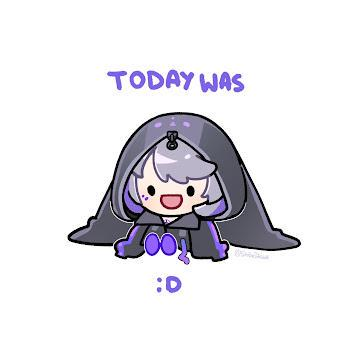

# COZY CUP
* At Cozy Cup, We Serve Delicious Meals, Fresh Coffee, and Handmade Drinks Made with Local Ingredients. Since 2024, We’ve Been Creating a Welcoming Space Where Great Food and Drinks Bring People Together. Every Visit is About Great Service and a Special Experience.

## Features & Screen Captures:

### Experience the Heart of Cozy Cup

* Since 2024, Cozy Cup has been a place where culinary passion and unforgettable experiences come together. We believe that food is more than just taste—it’s a journey that nourishes both the body and the soul. Every meal and drink we serve is made with love, care, and an unwavering commitment to quality. Our goal is to create a space where friends, families, and neighbors can come together to enjoy delicious, high-quality dishes and beverages, all crafted from the freshest local ingredients. Whether you're savoring the rich aroma of freshly brewed coffee or enjoying the comfort of a homemade meal, each item on our menu is carefully prepared to bring people together.

### Check Out Our Menu

* From rich, aromatic coffees to frothy cappuccinos, our drink menu has something for every craving. Whether you're in the mood for a refreshing smoothie or a sweet dessert to pair with your favorite brew, we've got you covered. When it comes to food, our popular menu items include hearty breakfast plates, fresh sandwiches, and satisfying lunch options made with the finest local ingredients. Come on in and check out what’s hot and fresh today—we promise there’s something for everyone to enjoy!

### MONTHLY SPECIALS

* Each month, we roll out exciting new specials that bring fresh, seasonal flavors to your table. From inventive breakfast options to savory lunch dishes and tempting desserts, our monthly creations are designed to surprise and delight. We carefully craft these limited-time items to showcase the best local ingredients and offer something new for our regulars and first-time visitors alike. Be sure to check out our latest offerings—you never know what delicious surprise awaits!

___

## About The Authors

Dirk Ydrei Herrera

202380398@psu.palawan.edu.ph

___

Mark Rian Fernandez IV

202180420@psu.palawan.edu.ph

